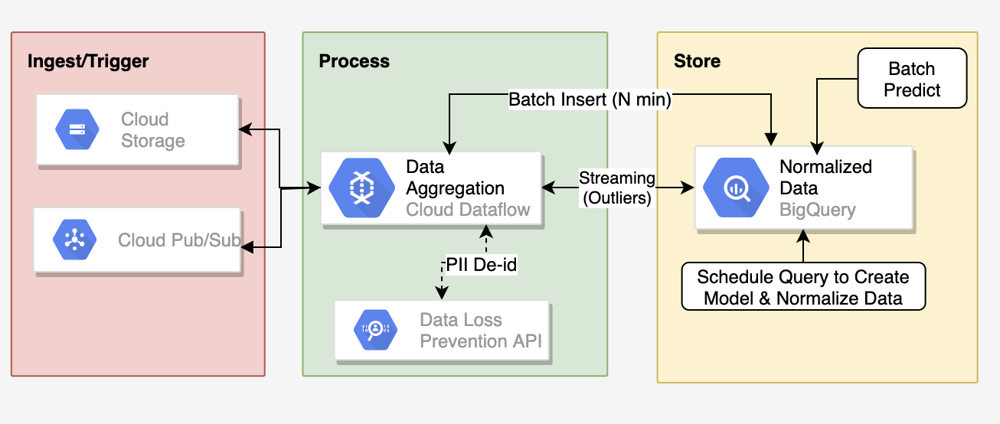
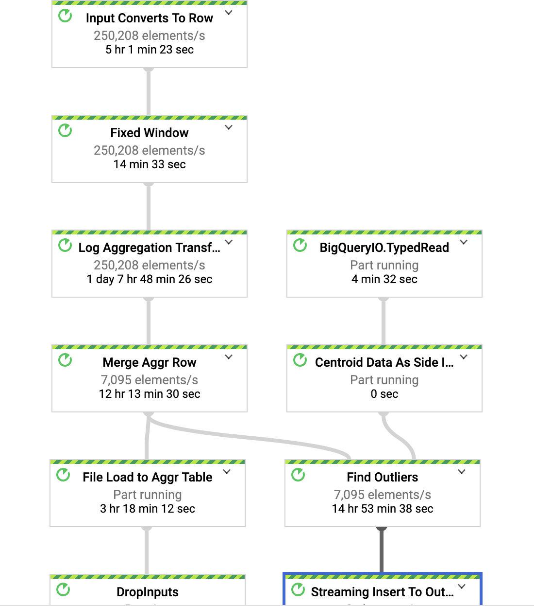

# Anomaly Detection Solution with ML To Predict Cyber Security Threat 
Securing its internal network from malware and security threats is critical at many customers. With the ever changing malware landscape and explosion of activities in IoT and M2M, existing signature based solutions for malware detection are no longer sufficient. This PoC highlights a ML based network anomaly detection solution using PubSub, Dataflow, BQ ML and DLP to detect mobile malware on subscriber devices and suspicious behaviour in wireless networks.

A dataflow streaming pipeline to process netflow log from GCS and/or PubSub to find outliers in real time. This solutio also K-Means Clustering Model created by using BQ-ML. In high level, this repo can be used to demo following 3 use cases:


1. <b>Streaming Analytics at Scale by using Dataflow/Beam. (Feature Extraction & Online Prediction)</b>
2. <b>Making Machine Learning easy by using BQ ML K-Means Clustering model.</b>
3. <b>Protecting sensitive information e.g:"IMSI" using Cloud DLP </b>


## End to end serverless architecture to innovate 


## Setup a Customer Demo

### Clone the Repo 

```glogin
git clone sso://user/masudhasan/df-network-log-streaming
```
### Enable APIs

```gcloud services enable bigquery
gcloud services enable storage_component
gcloud services enable dataflow
gcloud services enable cloudbuild.googleapis.com
```
### Access to Cloud Build Service Account 

```export PROJECT_ID=$(gcloud config get-value project)
export PROJECT_NUMBER=$(gcloud projects list --filter=${PROJECT_ID} --format="value(PROJECT_NUMBER)") 
gcloud projects add-iam-policy-binding ${PROJECT_ID} --member serviceAccount:$PROJECT_NUMBER@cloudbuild.gserviceaccount.com --role roles/editor
gcloud projects add-iam-policy-binding ${PROJECT_ID} --member serviceAccount:$PROJECT_NUMBER@cloudbuild.gserviceaccount.com --role roles/storage.objectAdmin
```
### Deploy the solution 
This script creates all the resourced required for the demo. For example: PubSub topic, subscriptions, Big Query Tables with normalized cluster data populated and dataflow pipeline.

```export DATASET=<var>bq-dataset-name</var>
export SUBSCRIPTION_ID=<var>subscription_id</var>
export TOPIC_ID=<var>topic_id</var>
export DATA_STORAGE_BUCKET=${PROJECT_ID}-<var>data-storage-bucket</var>
gcloud builds submit scripts/. --config scripts/cloud-build-demo.yaml --substitutions _DATASET=$DATASET,_DATA_STORAGE_BUCKET=$DATA_STORAGE_BUCKET,_SUBSCRIPTION_ID=${SUBSCRIPTION_ID},_TOPIC_ID=${TOPIC_ID},
_API_KEY=$(gcloud auth print-access-token)
```

### Generate some mock data (1k events/sec) in PubSub topic
````gradle run -DmainClass=com.google.solutions.df.log.aggregations.StreamingBenchmark \
 -Pargs="--streaming  --runner=DataflowRunner --project=${PROJECT_ID} --autoscalingAlgorithm=NONE --workerMachineType=n1-standard-4 --numWorkers=3 --maxNumWorkers=3 --qps=1000 --schemaLocation=gs://dynamic-template-test/wesp_json_schema.json --eventType=wesp --topic=${TOPIC_ID} --region=us-central1"
````
### Publish an outlier with an unusal tx & rx bytes
```gcloud pubsub topics publish ${TOPIC_ID} --message "{\"subscriberId\": \"my-customer-demo\",\"srcIP\": \"12.0.9.4\",\"dstIP\": \"12.0.1.3\",\"srcPort\": 5000,\"dstPort\": 3000,\"txBytes\": 15000000,\"rxBytes\": 4000000,\"startTime\": 1570276550,\"endTime\": 1570276550,\"tcpFlag\": 0,\"protocolName\": \"tcp\",\"protocolNumber\": 0}"
```

### Clean up
Please stop/cancel the dataflow pipeline manually from the UI. 
##  Learn More 

### Example input log data and output after aggregation

Sample Input Data

```
{
 \"subscriberId\": \"100\",
 \"srcIP\": \"12.0.9.4",
 \"dstIP\": \"12.0.1.2\",
 \"srcPort\": 5000,
 \"dstPort\": 3000,
 \"txBytes\": 15,
 \"rxBytes\": 40,
 \"startTime\": 1570276550,
 \"endTime\": 1570276559,
 \"tcpFlag\": 0,
 \"protocolName\": \"tcp\",
 \"protocolNumber\": 0
}, 
{
\"subscriberId\": \"100\",
\"srcIP\": \"12.0.9.4\",
\"dstIP\": \"12.0.1.2\",
\"srcPort\": 5000,
\"dstPort\": 3000,
\"txBytes\": 10,
\"rxBytes\": 40,
\"startTime\": 1570276650,
\"endTime\": 11570276750,,
\"tcpFlag\": 0,
\"protocolName\": \"tcp\",
\"protocolNumber\": 0
}
```

Output after aggregation in N-min fixed window and event time trigger.

1. Added processing timestamp.
2. Group by destination subnet and subscriberId
3. Number of approximate unique IP 
4. Number of approximate unique port
5. Number of unique records
6. Max, min, avg txBytes
7. Max, min, avg rxBytes
8. Max, min, avg duration    

```
{
  "transaction_time": "2019-10-27 23:22:17.848000",
  "subscriber_id": "100",
  "dst_subnet": "12.0.1.2/22",
  "number_of_unique_ips": "1",
  "number_of_unique_ports": "1",
  "number_of_records": "2",
  "max_tx_bytes": "15",
  "min_tx_bytes": "10",
  "avg_tx_bytes": "12.5",
  "max_rx_bytes": "40",
  "min_rx_bytes": "40",
  "avg_rx_bytes": "40.0",
  "max_duration": "100",
  "min_duration": "9",
  "avg_duration": "54.5"
}
```

### Aggregation Using Beam Schema Inferring 
```.apply("Group By SubId & DestSubNet",
   Group.<Row>byFieldNames("subscriberId", "dstSubnet")
      .aggregateField(
         "srcIP",
            new ApproximateUnique.ApproximateUniqueCombineFn<String>(
                 SAMPLE_SIZE, StringUtf8Coder.of()),
                    "number_of_unique_ips")
      .aggregateField(
          "srcPort",
              new ApproximateUnique.ApproximateUniqueCombineFn<Integer>(
                  SAMPLE_SIZE, VarIntCoder.of()),
                    "number_of_unique_ports")
      .aggregateField("srcIP", Count.combineFn(), "number_of_records")
      .aggregateField("txBytes", new AvgCombineFn(), "avg_tx_bytes")
      .aggregateField("txBytes", Max.ofIntegers(), "max_tx_bytes")
      .aggregateField("txBytes", Min.ofIntegers(), "min_tx_bytes")
      .aggregateField("rxBytes", new AvgCombineFn(), "avg_rx_bytes")
      .aggregateField("rxBytes", Max.ofIntegers(), "max_rx_bytes")
      .aggregateField("rxBytes", Min.ofIntegers(), "min_rx_bytes")
      .aggregateField("duration",new AvgCombineFn(), "avg_duration")
      .aggregateField("duration", Max.ofIntegers(), "max_duration")
      .aggregateField("duration", Min.ofIntegers(), "min_duration"));
```

### Create a K-Means model using BQ ML 

Please use the json schema (aggr_log_table_schema.json) to create the table in BQ.
Cluster_model_data table is partition by 'ingestion timestamp' and clustered by dst_subnet and subscriber_id.

```--> train data select
CREATE or REPLACE TABLE network_logs.train_data as (select * from network_logs.cluster_model_data 
where _PARTITIONDATE between '2019-10-01' AND '2019-10-02';
--> create model
CREATE OR REPLACE model network_logs.log_cluster_2 options(model_type='kmeans', num_clusters=4, standardize_features = true) 
AS select * except (transaction_time, subscriber_id, number_of_unique_ips, number_of_unique_ports, dst_subnet) 
from network_logs.train_data;
```

### Normalize Data

1. Predict on the train dataset to get the nearest distance from centroid for each record.
2. Calculate the STD DEV for each point to normalize
3. Store them in a table dataflow pipeline can use as side input  

```CREATE or REPLACE table network_logs.normalized_centroid_data AS(
with centroid_details AS (
select centroid_id,array_agg(struct(feature as name, round(numerical_value,1) as value) order by centroid_id) AS cluster
from ML.CENTROIDS(model network_logs.log_cluster_2)
group by centroid_id),
cluster as (select centroid_details.centroid_id as centroid_id,
(select value from unnest(cluster) where name = 'number_of_records') AS number_of_records,
(select value from unnest(cluster) where name = 'max_tx_bytes') AS max_tx_bytes,
(select value from unnest(cluster) where name = 'min_tx_bytes') AS min_tx_bytes,
(select value from unnest(cluster) where name = 'avg_tx_bytes') AS avg_tx_bytes,
(select value from unnest(cluster) where name = 'max_rx_bytes') AS max_rx_bytes,
(select value from unnest(cluster) where name = 'min_rx_bytes') AS min_rx_bytes,
(select value from unnest(cluster) where name = 'avg_rx_bytes') AS avg_rx_bytes,
(select value from unnest(cluster) where name = 'max_duration') AS max_duration,
(select value from unnest(cluster) where name = 'min_duration') AS min_duration,
(select value from unnest(cluster) where name = 'avg_duration') AS avg_duration
from centroid_details order by centroid_id asc),
predict as (select * from ML.PREDICT(model network_logs.log_cluster_2, (select * from network_logs.train_data)))
select c.centroid_id as centroid_id, 
(stddev((p.number_of_records-c.number_of_records)
+(p.max_tx_bytes-c.max_tx_bytes)
+(p.min_tx_bytes-c.min_tx_bytes)
+(p.avg_tx_bytes-c.min_tx_bytes)
+(p.max_rx_bytes-c.max_rx_bytes)
+(p.min_rx_bytes-c.min_rx_bytes)
+(p.avg_rx_bytes-c.min_rx_bytes)
+(p.max_duration-c.max_duration)
+(p.min_duration-c.min_duration)
+(p.avg_duration-c.avg_duration)))as normalized_dest, 
any_value(c.number_of_records) as number_of_records,
any_value(c.max_tx_bytes) as max_tx_bytes,
any_value(c.min_tx_bytes) as min_tx_bytes ,
any_value(c.avg_tx_bytes) as avg_tx_bytes,
any_value(c.max_rx_bytes) as max_rx_bytes, 
any_value(c.min_tx_bytes) as min_rx_bytes, 
any_value(c.avg_rx_bytes) as avg_rx_bytes,  
any_value(c.avg_duration) as avg_duration,
any_value(c.max_duration) as max_duration, 
any_value(c.min_duration) as min_duration
from predict as p 
inner join cluster as c on c.centroid_id = p.centroid_id
group by c.centroid_id);
```


### Find the Outliers

1. Find the nearest distance from the centroid.  
2. Calculate STD DEV between input and centroid vectors 
3. Find the Z Score (difference between a value in the sample and the mean, and divide it by the standard deviation)
4. A socre of 2 (2 STD DEV above the mean is an OUTLIER). 

## Before Start (Optional Step if Cloud Build Script is NOT used)

````gcloud services enable dataflow
gcloud services enable big query
gcloud services enable storage_component
````

## Creating a BigQuery Dataset and Tables

Dataset

```bq --location=US mk -d \ 
--description "Network Logs Dataset \ 
network_logs
```
Aggregation Data Table 

```bq mk -t --schema aggr_log_table_schema.json  \
--time_partitioning_type=DAY \
--clustering_fields=dst_subnet, subscriber_id \
--description "Network Log Partition Table" \
--label myorg:prod \
custom-network-test:network_logs.cluster_model_data 
```

Outlier Table 

```bq mk -t --schema outlier_table_schema.json \
--label myorg:prod \
custom-network-test:network_logs.outlier_data 
```

## Build & Run
To Build 

```gradle spotlessApply -DmainClass=com.google.solutions.df.log.aggregations.SecureLogAggregationPipeline 
gradle build -DmainClass=com.google.solutions.df.log.aggregations.SecureLogAggregationPipeline 
```

To Run  (To Do: Take out project reference) 

```gradle run -DmainClass=com.google.solutions.df.log.aggregations.SecureLogAggregationPipeline \
 -Pargs="--streaming --project=custom-network-test --runner=DataflowRunner --autoscalingAlgorithm=NONE --numWorkers=50 --maxNumWorkers=50 --workerMachineType=n1-highmem-8  --subscriberId=projects/custom-network-test/subscriptions/log-sub --network=my-custom-network --tableSpec=custom-network-test:network_logs.cluster_model_data --subnetwork=regions/us-central1/subnetworks/custom-network-1  --region=us-central1  --batchFrequency=10 --customGcsTempLocation=gs://df-temp-loc/file_load --usePublicIps=false --clusterQuery=gs://dynamic-template-test/normalized_cluster_data.sql
--outlierTableSpec=custom-network-test:network_logs.outlier_data 
--windowInterval=5 --tempLocation=gs://df-temp-loc/temp --writeMethod=FILE_LOADS --diskSizeGb=500 --workerDiskType=compute.googleapis.com/projects/custom-network-test/zones/us-central1-b/diskTypes/pd-ssd"
```

## Test 

Publish mock log data at 250k msg/sec

Schema used for load test: 

```{
 "subscriberId": "{{username()}}",
 "srcIP": "{{ipv4()}}",
 "dstIP": "{{subnet()}}",
 "srcPort": {{integer(1000,5000)}},
 "dstPort": {{integer(1000,5000)}},
 "txBytes": {{integer(10,1000)}},
 "rxBytes": {{integer(10,1000)}},
 "startTime": {{starttime()}},
 "endTime": {{endtime()}},
 "tcpFlag": {{integer(0,65)}},
 "protocolName": "{{random("tcp","udp","http")}}",
 "protocolNumber": {{integer(0,1)}}
}
```

To Run: 

```gradle run -DmainClass=com.google.solutions.df.log.aggregations.StreamingBenchmark \
 -Pargs="--streaming  --runner=DataflowRunner --project=s3-dlp-experiment --autoscalingAlgorithm=NONE --workerMachineType=n1-standard-4 --numWorkers=50 --maxNumWorkers=50 --qps=250000 --schemaLocation=gs://dynamic-template-test/wesp_json_schema.json --eventType=wesp --topic=projects/custom-network-test/topics/events --region=us-central1"
``` 

Outlier Test 
```
gcloud pubsub topics publish events --message "{\"subscriberId\": \"demo1\",\"srcIP\": \"12.0.9.4\",\"dstIP\": \"12.0.1.3\",\"srcPort\": 5000,\"dstPort\": 3000,\"txBytes\": 150000,\"rxBytes\": 40000,\"startTime\": 1570276550,\"endTime\": 1570276550,\"tcpFlag\": 0,\"protocolName\": \"tcp\",\"protocolNumber\": 0}"
```
```
gcloud pubsub topics publish events --message "{\"subscriberId\": \"demo1\",\"srcIP\": \"12.0.9.4\",\"dstIP\": \"12.0.1.3\",\"srcPort\": 5000,\"dstPort\": 3000,\"txBytes\": 15000000,\"rxBytes\": 4000000,\"startTime\": 1570276550,\"endTime\": 1570276550,\"tcpFlag\": 0,\"protocolName\": \"tcp\",\"protocolNumber\": 0}"
```

Feature Extraction Test

```gcloud pubsub topics publish events --message "{\"subscriberId\": \"100\",\"srcIP\": \"12.0.9.4\",\"dstIP\": \"12.0.1.2\",\"srcPort\": 5000,\"dstPort\": 3000,\"txBytes\": 10,\"rxBytes\": 40,\"startTime\": 1570276550,\"endTime\": 1570276559,\"tcpFlag\": 0,\"protocolName\": \"tcp\",\"protocolNumber\": 0}"
```
```gcloud pubsub topics publish events --message "{\"subscriberId\": \"100\",\"srcIP\": \"13.0.9.4\",\"dstIP\": \"12.0.1.2\",\"srcPort\": 5001,\"dstPort\": 3000,\"txBytes\": 15,\"rxBytes\": 40,\"startTime\": 1570276650,\"endTime\": 1570276750,\"tcpFlag\": 0,\"protocolName\": \"tcp\",\"protocolNumber\": 0}"
OUTPUT: INFO: row value Row:[2, 2, 2, 12.5, 15, 10, 50]
```

```gcloud pubsub topics publish events --message "{\"subscriberId\": \"100\",\"srcIP\": \"12.0.9.4\",\"dstIP\": \"12.0.1.2\",\"srcPort\": 5000,\"dstPort\": 3000,\"txBytes\": 10,\"rxBytes\": 40,\"startTime\": 1570276550,\"endTime\": 1570276550,\"tcpFlag\": 0,\"protocolName\": \"tcp\",\"protocolNumber\": 0}"
gcloud pubsub topics publish events --message "{\"subscriberId\": \"100\",\"srcIP\": \"12.0.9.4\",\"dstIP\": \"12.0.1.2\",\"srcPort\": 5000,\"dstPort\": 3000,\"txBytes\": 15,\"rxBytes\": 40,\"startTime\": 1570276550,\"endTime\": 1570276550,\"tcpFlag\": 0,\"protocolName\": \"tcp\",\"protocolNumber\": 0}"
OUTPUT INFO: row value Row:[1, 1, 2, 12.5, 15, 10, 0]
```
## Pipeline Performance at 250k msg/sec

Pipeline DAG (ToDo: change with updated pipeline DAG)



Msg Rate


Ack Message Rate


CPU Utilization


System Latency 


### K-Means Clustering Using BQ-ML (Model Evaluation)


## To Do
- Unit test 
- Take out references
- Open Source


